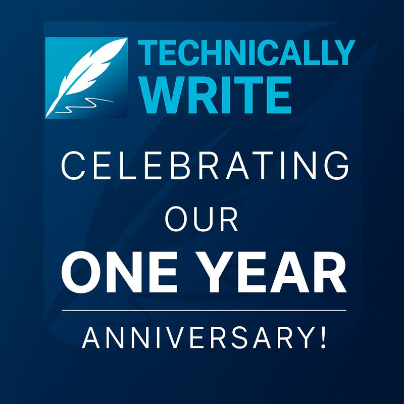

Reflecting on our first year in business fills us with gratitude for the remarkable journey we've had. From establishing solid foundations to forging partnerships with exceptional clients, our focus on teamwork and innovation has driven our success in delivering top-notch technical writing services and documentation solutions.

The trust and support we've received have been invaluable, propelling us towards even greater heights. With newfound capabilities in place, we are poised to broaden our client portfolio. Whether you're wanting to revamp your [technical documentation](/technical-documentation-services/), streamline processes, or execute improvement projects, we're here to help. Here’s to continued growth and collaboration! 🚀

{/* truncate */}

[**Contact Us**](/contact/)
