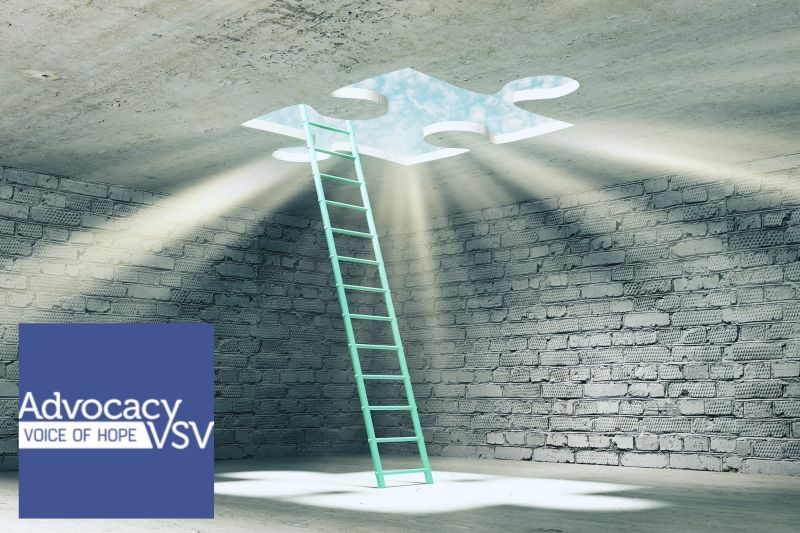

## Supporting Advocacy VSV in Newry
Technically Write Ltd. was proud this weekend to be one of the local sponsors of the Lipsync competition run by Advocacy VSV in Newry. Advocacy VSV is based in the Mourne area and they offer a much needed support service to victims of sexual violence living in Northern Ireland. It is a lifeline to those who need support through extremely difficult circumstances.

When you hear how they help victims, this is such a worthy cause. We hope to support Advocacy VSV next year again.

{/* truncate */}

To enquire about our enquire about our [technical documentation services](/technical-documentation-services/), or to obtain a quotation, [**Contact Us**](/contact/).
